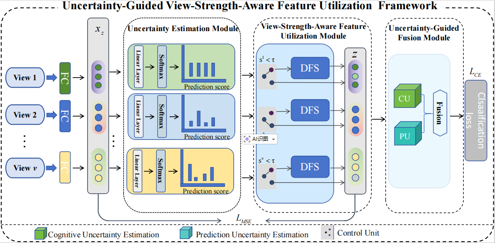

_**This paper has been accepted to AAAI 2026**_

<h2 align="center"> <a href="https://ojs.aaai.org/index.php/AAAI/article/view/39599">Uncertainty-Guided View-Strength-Aware Feature Utilization for Multi-View Classification</a></h2>

**[Li Lv1](https://github.com/lvli-rise/), _Qian Guo_2, _Li Zhang_1,  _Liang Du_1,  _Bingbing Jiang_4, _Lu Chen_1,[Xinyan Liang1](https://xinyanliang.github.io/)**

1Institute of Big Data Science and Industry, Taiyuan 030006, China, 
2State Key Laboratory of AI Safety, Beijing, 100086, China, 
3Shanxi Key Laboratory of Big Data Analysis and Parallel Computing, 
Taiyuan University of Science and Technology 
4School of Information Science and Technology, Hangzhou Normal University, Hangzhou, China 

## Abstract
In multi-view classification tasks (MVC), each view provides an unique perspective on the data, offering complementary information that can improve classification performance when properly integrated. However, traditional methods typically adopt a uniform processing strategy for all views before fusion, overlooking the fact that different views may require different treatments due to variations in their quality and informativeness. 
To address this limitation, we propose a novel framework called Uncertainty-Guided View-Strength-Aware Feature Utilization (UVF) for multi-view classification. Our approach introduces a view uncertainty estimation module to quantify the discriminative strength of each view. Based on this estimation, a Differentiated Feature Selector (DFS) adaptively selects features, retaining informative dimensions in weak views while preserving original features in strong views. Furthermore, we employ an uncertainty-guided fusion strategy that assigns dynamic weights to each view's contribution based on its uncertainty score, enhancing the robustness and reliability of the final decision. Experimental results on benchmark datasets demonstrate that our method significantly outperforms conventional approaches, achieving better classification accuracy and interpretability through strength-aware feature processing and fusion.

## 🏗️Model

  

